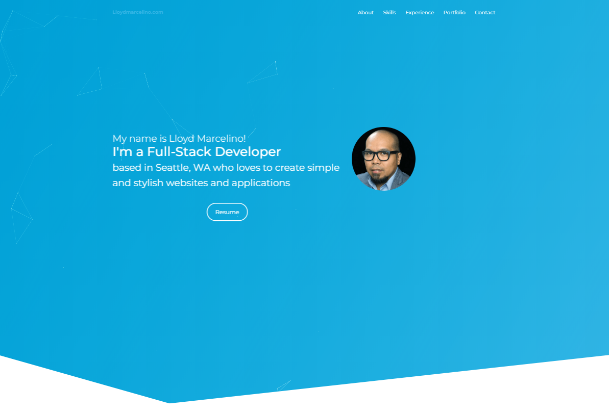
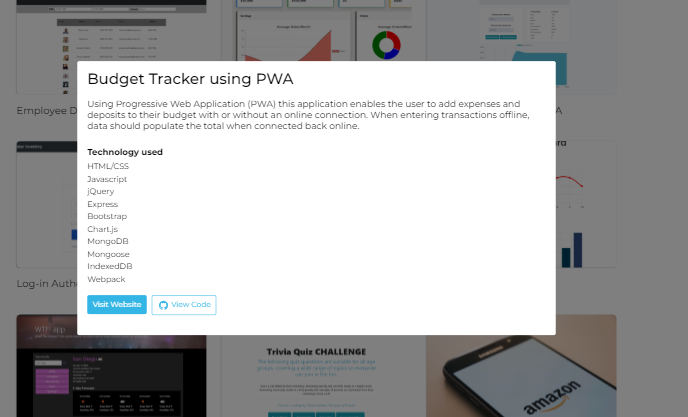

# Portfolio-React


- This is my professional portfolio using React.

## Table of contents
- [General Info](#Info)
- [Install](#Install)
- [Dependencies](#Dependencies)
- [Technologies](#Technologies)
- [Demo](#Demo)
- [Author](#Author)
- [License](#License)

# General Info

- Tab icon has been modified to have my own icon.

### Public
- This folder contains the **index.html**, **css**, and **images**. I modified the tab icon by updloading my own icon and change the code on index.html and manifest.json
```bash 
<link rel="shortcut icon" href="%PUBLIC_URL%/lloyd.ico" />
```
```bash
 "icons": [
    {
      "src": "lloyd.ico",
      "sizes": "64x64 32x32 24x24 16x16",
      "type": "image/x-icon"
    }
```


### Componets
> **Modal** - this component is use to view the content information on my projects.
```bash
import React from 'react';
import "./Modal.css";

const Modal = (props) => (
	<div className="modal">
		<div className="modal-content">
			<div className="modal-body">
				{props.children}
			</div>
		</div>
	</div>
)

export default Modal;

```


To get more info on how to use Modal (React) in a project please visit this website: https://codeburst.io/modals-in-react-f6c3ff9f4701

> **Projects** - this folder contains code to structure the Portfolio section. **[Project.js]** is the code for the Portfolio projects heading. **[ProjectList.js]** handles the buttons inside the Modal. **[ProjectInfo.js]** handles what information is inside the Modal (ie. templates).

> **About.js** - this is the code for the About section.

> **Contact.js** - this is the code for the Contact section.
- I used formik and yup for the contact form to work. Any messages that is created within my website will be forwared on my personal email. You can find information on how to use formik and yup here: https://blog.bitsrc.io/handling-react-forms-and-validation-with-formik-and-yup-dc789fd9e485

- I also used a thrid party service called **formcarry.com**. It is a form processing service which allowed me to handle forms on my page without the back-end code. Visit their website for information: https://formcarry.com/

- **FRAGMENTS** - it lets you group a list of children without adding extra nodes to the DOM.

> **Footer.js** - this is the code for the footer

> **Header.js** - this is the code for the navbar menu.

> **Hero.js** - this is the code for the main header and my image. I used (Particles) react-particle-js to achieve the animation. Click here to get more information: https://www.npmjs.com/package/react-particles-js

> **Skills.js** - this is the code for the skills section. I used react-circular-progressbar and react-visibility-sensor to achieve the circular animation. Click here for more information: https://www.npmjs.com/package/react-circular-progressbar | https://github.com/joshwnj/react-visibility-sensor

> **Timeline.js** - this is the code for the experience section. 

### Data

> **portfolio.js** - an API I created containing all the information on the web page. By doing so, it is much easier to edit information within the web application.

### SASS
> This folder contains SASS (css extention)


## Deployement

- For my Portfolio application I used Amazon Web Services (AWS) [S3 bucket and Route 53]. I also purchased a domain (lloydmarcelino.com) via Go Daddy.


- https://www.youtube.com/watch?v=D6qB7MEFOe0 - this video shows how I deployed my application.

**Other options on how to deploy a react app on AWS:**

- **Option 1**: Here is a video on how to deploy a react application on AWS using AWS Amplify (make sure you select the N. Virginia Server): https://www.youtube.com/watch?v=xT2OhBTjZDY

- **Option 2**: Here is a video on how to deploy a react application on AWS using S3 bucket: https://www.youtube.com/watch?v=rVj3zc30-8E

- **Option 3**: Here is a video on how to deploy a react up on AWS using yarn in less than 8 minutes: https://www.youtube.com/watch?v=PqUYq2Wx0lc - Website info: https://medium.com/serverlessguru/deploy-reactjs-app-with-s3-static-hosting-f640cb49d7e6


**What is AWS (Amazon Web Services)?**

 Amazon web service is a platform that offers flexible, reliable, scalable, easy-to-use and cost-effective cloud computing solutions.

AWS has a massive collection of cloud services that build up a fully-fledged platform. It is known as a powerhouse of storage, databases, analytics, networking and deployment/delivery options offered to developers. AWS Cloud is available in 16 different geographic regions, and the number is increasing.

**Here are the pros/benefits of selecting AWS web services:**

- You should opt for AWS when you have DevOps teams who can configure and manage the infrastructure
- You have very little time to spend on the deployment of a new version of your web or mobile app.
- AWS offers easy deployment process for an app
- AWS web service is an ideal option when your project needs high computing power
- Helps you to improve the productivity of the application development team
- A range of automated functionalities including the configuration, scaling, setup, and others
- Use AWS you have full control over the resources.
AWS allows organizations to use the already familiar programming models, operating systems, databases, and architectures.
- It is a cost-effective service that allows you to pay only for what you use, without any up-front or long-term commitments.
- You will not require to spend money on running and maintaining data centers.
- Offers fast deployments
- You can easily add or remove capacity.
- You are allowed cloud access quickly with limitless capacity.
- Total Cost of Ownership is very low compared to any private/dedicated servers.
- Offers Centralized Billing and management
- Offers Hybrid Capabilities
- Allows you to deploy your application in multiple regions around the world with just a few clicks


# Install
``` bash
   npm install
```

# Dependencies
``` bash
    "dependencies": {
    "axios": "^0.19.0",
    "bootstrap": "^4.4.1",
    "formik": "^1.5.7",
    "node-sass": "^4.12.0",
    "react": "^16.8.6",
    "react-circular-progressbar": "^2.0.1",
    "react-dom": "^16.8.6",
    "react-particles-js": "^2.6.0",
    "react-rounded-image": "^2.0.2",
    "react-scripts": "3.0.1",
    "react-scroll": "^1.7.12",
    "react-typing-animation": "^1.6.2",
    "react-typist": "^2.0.5",
    "react-validation": "^3.0.7",
    "react-visibility-sensor": "^5.0.2",
    "react-waypoint": "^9.0.2",
    "reactstrap": "^8.4.1",
    "yup": "^0.27.0"
  },
```
``` bash
    "scripts": {
    "start": "react-scripts start",
    "build": "react-scripts build",
    "test": "react-scripts test",
    "eject": "react-scripts eject"
  },
```

In the project directory, you can run:
``` bash
npm run start
```
Runs the app in the development mode.
Open http://localhost:3000 to view it in the browser.

The page will reload if you make edits.
You will also see any lint errors in the console.
``` bash
npm test
```
Launches the test runner in the interactive watch mode.
See the section about running tests for more information.
``` bash
npm run build
```
Builds the app for production to the build folder.
It correctly bundles React in production mode and optimizes the build for the best performance.

The build is minified and the filenames include the hashes.
Your app is ready to be deployed!

See the section about deployment for more information.
``` bash
npm run eject
```
Note: this is a one-way operation. Once you eject, you can’t go back!

If you aren’t satisfied with the build tool and configuration choices, you can eject at any time. This command will remove the single build dependency from your project.

Instead, it will copy all the configuration files and the transitive dependencies (webpack, Babel, ESLint, etc) right into your project so you have full control over them. All of the commands except eject will still work, but they will point to the copied scripts so you can tweak them. At this point you’re on your own.

You don’t have to ever use eject. The curated feature set is suitable for small and middle deployments, and you shouldn’t feel obligated to use this feature. However we understand that this tool wouldn’t be useful if you couldn’t customize it when you are ready for it.

# Technologies
- HTML5
- CSS
- SASS
- JavaScript
- React
- Reactstrap (Bootstrap for React)

# Demo
- Go to https://lloydmarcelino.com

# Author
- Lloyd Marcelino 
- github: https://github.com/ethanlloyd21
- website: lloydmarcelino.com
- email: lloydmarcelino@gmail.com

# License
- see MIT License Copyright (c) 2020
